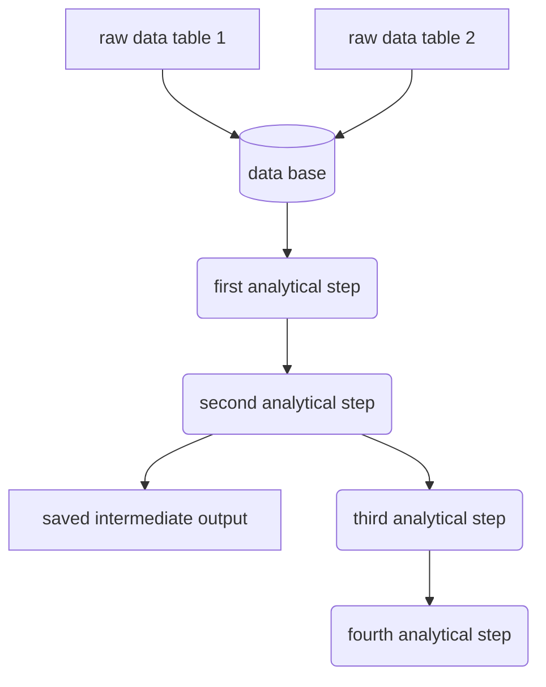

Test the [mermaid](https://mermaid-js.github.io/mermaid/#/) syntax for making diagrams in Github markdown.

Here is a diagram:

```mermaid

graph TD;
      A[raw data table 1]-->C[(data base)];
      B[raw data table 2]-->C;
      C-->D(first analytical step);
      D-->E(second analytical step);
      E-->F[saved intermediate output];
      E-->G(third analytical step);
      G-->H(fourth analytical step);
```

And here is some text after.
