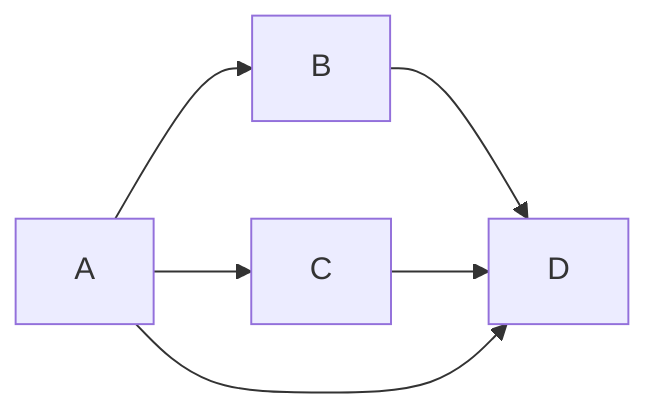

Test the [mermaid](https://mermaid-js.github.io/mermaid/#/) syntax for making diagrams in Github markdown.

```mermaid

graph LR;
      A-->B;
      A-->C;
      B-->D;
      C-->D;
      A-->D;
```
